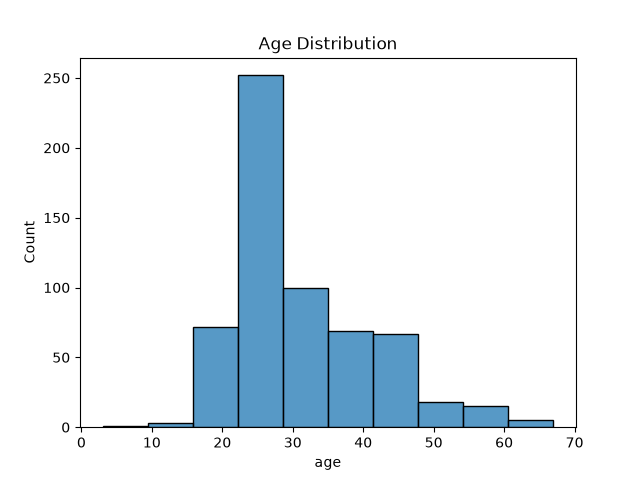
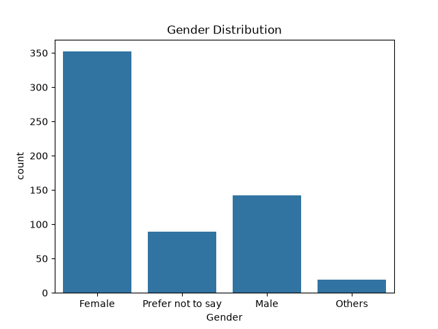
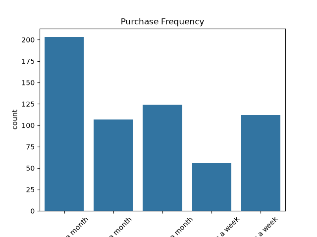
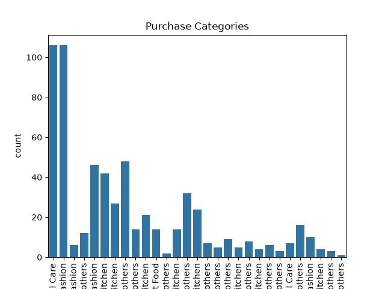
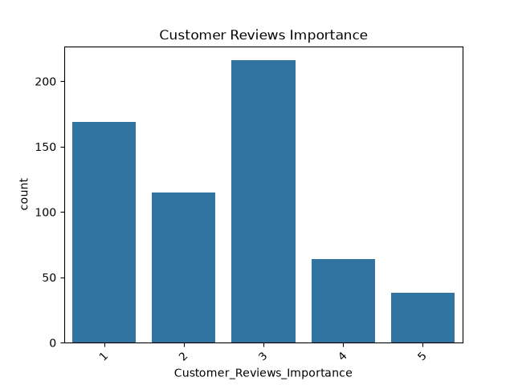
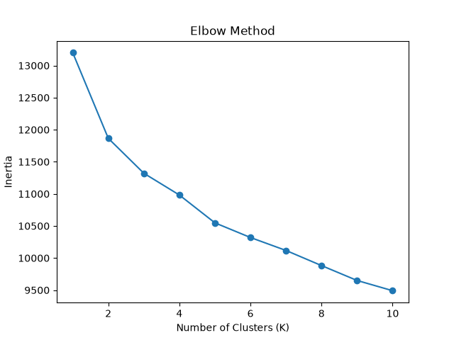

# 🛒 Amazon User Segmentation using Machine Learning

## 📌 Overview

This project segments Amazon customers into different groups based on their shopping behavior using the **K-Means Clustering** algorithm. Customer segmentation helps businesses understand user behavior and enables personalized marketing, better recommendations, and improved customer satisfaction.

---

## 🎯 Problem Statement

Amazon serves millions of customers with different shopping habits. Understanding customer behavior manually is difficult.

This project uses Machine Learning to identify customer segments based on factors such as:

- Purchase Frequency
- Product Categories
- Browsing Behavior
- Customer Reviews
- Shopping Satisfaction
- Recommendation Usage

---

## 📊 Dataset

- Dataset: Amazon Consumer Behaviour Survey
- Number of Records: **600+**
- Number of Features: **23**

---

## 🛠 Technologies Used

- Python
- Pandas
- NumPy
- Matplotlib
- Seaborn
- Scikit-learn
- K-Means Clustering

---

## 📂 Project Structure

```
AmazonSeg/
│
├── data/
│   ├── raw/
│   └── processed/
│
├── outputs/
│
├── src/
│   ├── data_loader.py
│   ├── preprocessing.py
│   ├── encoding.py
│   ├── scaling.py
│   ├── elbow_method.py
│   ├── kmeans_model.py
│   └── cluster_analysis.py
│
├── requirements.txt
├── README.md
└── LICENSE
```

---

## ⚙️ Workflow

1. Data Loading
2. Exploratory Data Analysis (EDA)
3. Data Cleaning
4. Label Encoding
5. Feature Scaling
6. Elbow Method
7. K-Means Clustering
8. Cluster Analysis

---

## 📈 Exploratory Data Analysis

### Age Distribution



---

### Gender Distribution



---

### Purchase Frequency



---

### Product Categories



---

### Review Importance



---

## 📉 Elbow Method

The Elbow Method was used to determine the optimal number of clusters for K-Means.



---

## 🤖 Machine Learning Model

Algorithm Used:

- K-Means Clustering

The model groups customers with similar shopping behavior into different customer segments.

---

## 📌 Results

- Successfully segmented **600+ Amazon customers**
- Identified **4 customer clusters**
- Performed customer behavior analysis using cluster statistics
- Generated insights useful for personalized marketing

---

## ▶️ How to Run

Clone the repository

```bash
git clone <repository-link>
```

Install dependencies

```bash
pip install -r requirements.txt
```

Run the scripts

```bash
python src/preprocessing.py
python src/encoding.py
python src/scaling.py
python src/elbow_method.py
python src/kmeans_model.py
python src/cluster_analysis.py
```

---

## 🚀 Future Improvements

- Compare K-Means with DBSCAN
- Build an interactive dashboard
- Use larger real-world Amazon datasets
- Deploy the project as a web application

---

## 👩‍💻 Author

**Pragnya Nemani**

B.Tech CSE (AI & ML)